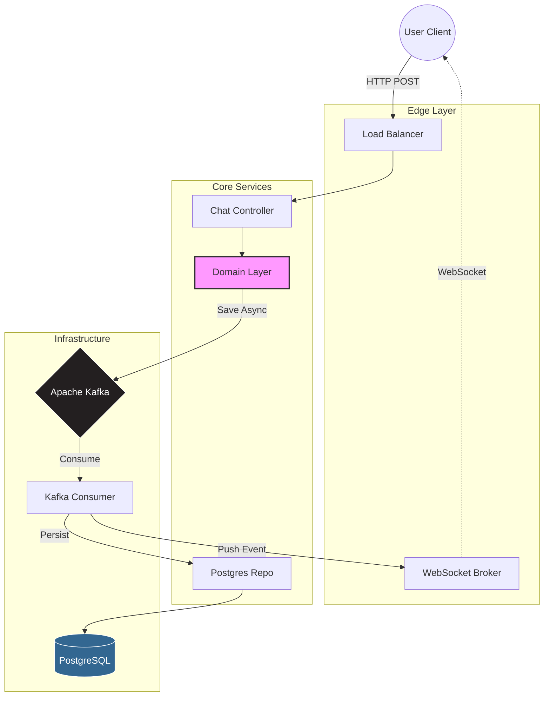

   
  
  
   
  
  
  
  
  
  
  

    

  <table>
    <tr>
      <td align="center" width="600px">
        <h3>🚧 PROJETO EM DESENVOLVIMENTO ATIVO 🚧</h3>
        Arquitetura Core funcional. Integração de Segurança e Gateway em progresso.
      </td>
    </tr>
  </table>

 

  <h2>🌟 Sobre o Projeto</h2>

  Este não é apenas um sistema de chat. É uma <strong>implementação de referência</strong> para sistemas distribuídos de alta performance. O objetivo é resolver o desafio da <em>latência de escrita</em> e <em>entrega em tempo real</em> utilizando uma arquitetura orientada a eventos.

  O projeto segue rigorosamente os princípios de <strong>Clean Architecture</strong> e <strong>Domain-Driven Design (DDD)</strong>, garantindo que o núcleo da aplicação permaneça agnóstico a frameworks, protegendo as regras de negócio.

 

<table align="center">
  <tr>
    <td align="center" width="300">
      
      <h3>⚡ Alta Performance</h3>
      
Escrita assíncrona via Kafka. O usuário nunca espera o banco de dados.

    </td>
    <td align="center" width="300">
      
      <h3>🏗️ Clean Arch & DDD</h3>
      
Domínio isolado. Camadas de Application e Infraestrutura desacopladas.

    </td>
    <td align="center" width="300">
      
      <h3>📡 Tempo Real</h3>
      
WebSocket com protocolo STOMP. Entrega instantânea (Push).

    </td>
  </tr>
</table>

 

<h2 align="center">🗺️ Roadmap de Engenharia</h2>

  <table>
    <thead>
      <tr>
        <th>Fase</th>
        <th>Status</th>
        <th>Progresso</th>
      </tr>
    </thead>
    <tbody>
      <tr>
        <td><strong>Fase 1: Core Domain</strong></td>
        <td>✅ Concluído</td>
        <td>
          
        </td>
      </tr>
      <tr>
        <td><strong>Fase 2: Mensageria (Kafka)</strong></td>
        <td>✅ Concluído</td>
        <td>
          
        </td>
      </tr>
      <tr>
        <td><strong>Fase 3: WebSocket & Inbox</strong></td>
        <td>✅ Concluído</td>
        <td>
          
        </td>
      </tr>
      <tr>
        <td><strong>Fase 4: Segurança (OAuth2)</strong></td>
        <td>🔄 Em Andamento</td>
        <td>
          
        </td>
      </tr>
      <tr>
        <td><strong>Fase 5: API Gateway</strong></td>
        <td>⏳ Planejado</td>
        <td>
          
        </td>
      </tr>
    </tbody>
  </table>

<h2 align="center">📐 Arquitetura do Sistema</h2>

  

  

  

    Desenvolvido por <strong>Mayara Amorim</strong>
     
  

