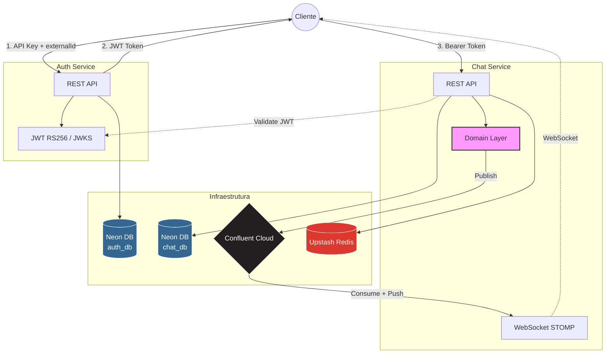

<div align="center">

  

  <br />

  
  
  
  
  
  
  
  

</div>

<br />

<p align="justify">
  Plataforma de chat multi-tenant em tempo real, construida como <strong>implementacao de referencia</strong> para sistemas distribuidos de alta performance. Resolve o desafio da <em>latencia de escrita</em> e <em>entrega em tempo real</em> com arquitetura orientada a eventos.
</p>

<p align="justify">
  Segue rigorosamente <strong>Clean Architecture</strong>, <strong>Domain-Driven Design (DDD)</strong> e principios <strong>SOLID</strong>, mantendo o nucleo da aplicacao agnostico a frameworks.
</p>

<br />

<h2 align="center">Arquitetura</h2>

<div align="center">
  <table>
    <tr>
      <td>

| Modulo | Descricao |
|--------|-----------|
| **shared-kernel** | Value objects compartilhados (`UserId`, `TenantId`) e excecoes |
| **auth-service** | Gerenciamento de tenants, usuarios e emissao de JWT (RS256) |
| **chat-service** | Conversas, mensagens, grupos, WebSocket STOMP, Kafka events |

  </td>
    </tr>
  </table>
</div>


```mermaid
graph TD
    User((Cliente))

    subgraph "Auth Service"
        AuthAPI[REST API]
        JWT[JWT RS256 / JWKS]
    end

    subgraph "Chat Service"
        ChatAPI[REST API]
        WS[WebSocket STOMP]
        Domain[Domain Layer]
    end

    subgraph "Infraestrutura"
        DB_Auth[(Neon DB<br>auth_db)]
        DB_Chat[(Neon DB<br>chat_db)]
        Kafka{Confluent Cloud}
        Redis[(Upstash Redis)]
    end

    User -->|1. API Key + externalId| AuthAPI
    AuthAPI -->|2. JWT Token| User
    AuthAPI --> DB_Auth
    AuthAPI --> JWT

    User -->|3. Bearer Token| ChatAPI
    ChatAPI --> Domain
    Domain -->|Publish| Kafka
    Kafka -->|Consume + Push| WS
    WS -.->|WebSocket| User

    ChatAPI --> DB_Chat
    ChatAPI --> Redis
    ChatAPI -.->|Validate JWT| JWT

    style Kafka fill:#231F20,stroke:#fff,color:#fff
    style DB_Auth fill:#336791,stroke:#fff,color:#fff
    style DB_Chat fill:#336791,stroke:#fff,color:#fff
    style Redis fill:#DC382D,stroke:#fff,color:#fff
    style Domain fill:#f9f,stroke:#333,stroke-width:2px
```

<h2 align="center">Stack</h2>

<div align="center">
  <table>
    <tr><th>Categoria</th><th>Tecnologia</th><th>Ambiente</th></tr>
    <tr><td>Linguagem</td><td>Java 25 (preview features + Virtual Threads)</td><td>Todos</td></tr>
    <tr><td>Framework</td><td>Spring Boot 4.0.2</td><td>Todos</td></tr>
    <tr><td>Banco de Dados</td><td>PostgreSQL 18</td><td>Local: Docker / Prod: <strong>Neon DB</strong> (serverless)</td></tr>
    <tr><td>Mensageria</td><td>Apache Kafka</td><td>Local: Docker / Prod: <strong>Confluent Cloud</strong> (SASL_SSL)</td></tr>
    <tr><td>Cache</td><td>Redis</td><td>Local: Docker / Prod: <strong>Upstash</strong> (serverless, TLS)</td></tr>
    <tr><td>Real-Time</td><td>WebSocket STOMP</td><td>Todos</td></tr>
    <tr><td>Autenticacao</td><td>JWT RS256 com JWKS endpoint</td><td>Todos</td></tr>
    <tr><td>Migrations</td><td>Flyway (vendor-specific)</td><td>Todos</td></tr>
    <tr><td>Cloud</td><td>GCP Cloud Run + Cloud Build + Artifact Registry + Secret Manager</td><td>Prod</td></tr>
    <tr><td>CI/CD</td><td>Cloud Build (trigger on push to develop)</td><td>Prod</td></tr>
    <tr><td>Containers</td><td>Docker multi-stage builds</td><td>Todos</td></tr>
  </table>
</div>

<h2 align="center">Roadmap</h2>

<div align="center">
  <table>
    <thead>
      <tr>
        <th>Fase</th>
        <th>Status</th>
        <th>Progresso</th>
      </tr>
    </thead>
    <tbody>
      <tr>
        <td><strong>Fase 1: Core Domain</strong></td>
        <td>Concluido</td>
        <td></td>
      </tr>
      <tr>
        <td><strong>Fase 2: Mensageria (Kafka)</strong></td>
        <td>Concluido</td>
        <td></td>
      </tr>
      <tr>
        <td><strong>Fase 3: WebSocket & Inbox</strong></td>
        <td>Concluido</td>
        <td></td>
      </tr>
      <tr>
        <td><strong>Fase 4: Seguranca (Auth Service)</strong></td>
        <td>Concluido</td>
        <td></td>
      </tr>
      <tr>
        <td><strong>Fase 5: Deploy GCP (Cloud Run + CI/CD)</strong></td>
        <td>Concluido</td>
        <td></td>
      </tr>
      <tr>
        <td><strong>Fase 6: File Upload (Signed URLs + GCS)</strong></td>
        <td>Em Design</td>
        <td></td>
      </tr>
      <tr>
        <td><strong>Fase 7: Moderacao Cross-Service</strong></td>
        <td>Planejado</td>
        <td></td>
      </tr>
    </tbody>
  </table>
</div>

<h2 align="center">Como Rodar</h2>

### Pre-requisitos

- Java 25
- Maven 3.9+
- Docker & Docker Compose

### Infraestrutura local

```bash
# Sobe PostgreSQL, Kafka, Redis
docker-compose up -d postgres-auth postgres-chat kafka redis
```

### Rodar os servicos

```bash
# Auth service (porta 8080)
mvn spring-boot:run -pl auth-service

# Chat service (porta 8081)
mvn spring-boot:run -pl chat-service
```

### Tudo via Docker Compose

```bash
# Sobe tudo (infra + servicos Java)
docker-compose up -d
```

### Swagger UI

- Auth: `http://localhost:8080/swagger-ui/index.html`
- Chat: `http://localhost:8081/swagger-ui/index.html`

<br />

<div align="center">
  <hr />
  <sub>Desenvolvido por <strong>Mayara Amorim</strong></sub>
</div>
